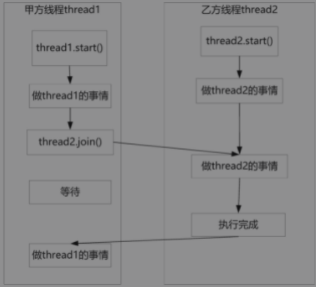

java高并发的核心知识点：
- 多线程
- 线程池
- 锁(java内置锁\juc显式锁)
- JMM(内存模型)
- CAS
- JUC(并发组件)
- AQS(抽象同步器，模板方法设计模式，并发组件实现的基础)
- 高并发设计模式


# 1 多线程、线程池核心原理及实战；线程安全问题；java内置锁的核心原理

进程
```text
进程是操作系统资源分配的最小单位。

进程是程序的一次启动执行，程序可以启动多次，可以对应多个进程，比如chrome浏览器，多个网页对应多个chrome进程。

应用程序以进程的形式运行在OS上。
一般来说，进程包含程序段，数据段和进程控制块3部分。

程序段：代码指令集合在内存中的位置
数据段：操作数集合在内存中的位置
控制块：进程的描述信息和调度信息等

Java进程：
每次启动一个java进程，都会启动一个jvm进程，进程内都是以多个线程来执行，程序入口进去是主线程。还要一个必须的GC线程(守护线程)。

```


线程
```text
线程是CPU调度的最小单位。

CPU时间片调度算法（抢占式获得cpu时间片）

一个线程主要是3部分：线程描述信息，程序计数器（program counter PC）和栈内存

线程ID，一个进程内的thread id不会重复，JVM管理

thread name，可以指定，不指定系统自动分配

线程优先级，只是一种标识，不一定有效，不同系统优先级别不一样，默认1-10，5


线程状态，新建，就绪，运行，阻塞，结束

其他属性，是否是守护线程等

程序计数器，记录的是线程下一条指令的内存地址

栈内存里包含了栈需要的局部变量和方法的栈帧，栈私有，jdk8中，每个线程创建时默认分配1M大小的内存（golang的协程更加轻量级）。

栈内存和堆内存不同，不受GC管理。
```


```java
System.out.println("current thread name: " + 
Thread.currentThread().getName());

System.out.println("current thread id: " + 
Thread.currentThread().getId());

System.out.println("current thread status: " + 
Thread.currentThread().getState());

System.out.println("current thread priority: " + 
Thread.currentThread().getPriority());
```

进程和线程的区别：
```text
1. 一个进程里有多个线程，至少有一个线程
2. 线程是CPU调度的最小单位，进程是OS分配资源的最小单位
3. 进程间互相独立，进程内部的线程可以共享资源
4. 线程上下文切换代价小于进程上下文切换
```

创建线程的4种方式：
```java
// java.lang.Thread
/**
Thread(String name)
Thread(Runnable target)
Thread(Runnable target, String name)

int getId()
String getName()
void setName(String name)
int getPriotity()
void setPriority(int)

static Thread currentThread()
static void sleep(long millis)

void setDaemon(boolean on)
boolean isDaemon()

void start()
void run()

void join()
void join(long millis)
void join(long millis, int nanos)
boolean isAlive()

static void yield()
static void sleep()
*/

public static final int MIN_PRIORITY = 1;
public static final int NORM_PRIORITY = 5;
public static final int MAX_PRIORITY = 10;

public static enum State {
    NEW,            // 新建
    RUNNABLE,       // 就绪，运行
    BLOCKED,        // 阻塞
    WAITING,        // 等待
    TIMED_WAITING,  // 超时等待
    TERMINATED;     // 结束
}

private Runnable target;
public void run() {
    if (this.target != null) {
        this.target.run();
    }
}

// start()启动一个线程
// run()线程逻辑的执行入口函数
```

1. 继承Thread
```java
Thread t = new Thread();
System.out.println(t.getName()); // Thread-0
t.start();

class T extends Thread {
    T(String name) {
        super(name);    
    }
    @Override
    public void run() {
        System.out.println(super.getName()+" running...");
    }
}
T t1 = new T("t1");
t1.start();
```

2. 实现Runnable
```java
// java.lang.Runnable
package java.lang;
@FunctionalInterface
public interface Runnable {
    void run();
}

class Run1 implements Runnable {
    public void run() {
        System.out.println(Thread.currentThread().getName()+" running...");
    }
}
Thread t2 = new Thread(new Run1, "t2");
t2.start();

// 匿名内部类的方式
Thread t3 = new Thread(new Runnable() {
    public void run() {
        System.out.println(Thread.currentThread().getName()+" running...");
    }
});
t3.start();
// lambda方式
new Thread(() -> {
    public void run() {
        System.out.println(Thread.currentThread().getName()+" running...");
    }
}).start();
```

Thread和实现Runnable接口的不同：
Runnable接口可以更好的逻辑和数据分离
```java
import java.util.concurrent.atomic.AtomicInteger;

public class T1 {
    public static final int num = 5;
    public static void main(String[] args) {
        // 2个卖，每个都有5个
        /*for (int i=1;i<=2;i++) {
            new Inner1("worker "+i).start();
        }*/
        // 2个卖，总共5个
        Inner2 inner2 = new Inner2();
        for (int i=1;i<=2;i++) {
            new Thread(inner2, "worker "+i).start();
        }

    }
    static class Inner2 implements Runnable {
        private AtomicInteger in = new AtomicInteger(num);
        @Override
        public void run() {
            for (int i=0;i<=num;i++) {
                if (in.get() > 0) {
                    System.out.println(Thread.currentThread().getName()
                            +" sold one, left " + in.decrementAndGet());
                }
            }
        }
    }
    static class Inner1 extends Thread {
        Inner1 (String name) {
            super(name);
        }
        private int sum = num;
        public void run () {
            for (int i=0;i<=num;i++) {
                if (sum > 0) {
                    System.out.println(getName()+" sold one, left " + (--sum));
                }
            }
        }
    }
}
```

3. 使用Callable接口和FutureTask类创建带返回值的线程

Thread类和Runnable接口的run()没有返回值

```java
package java.util.concurrent;
@FunctionalInterface
public interface Callable<T> {
    V call() throws Exception;
}

Callable接口显然不能直接作为Thread种的Runnable target来使用，需要一个适配的接口RunnableFuture
，这个接口既可以作为target使用，也可以获取线程返回值。

package java.util.concurrent;
@FunctionalInterface
public interface RunnableFuture<V> extends Runnable, Future<V> {
    void run();
}

Future接口提供了多个针对线程的功能：
1. 能够取消异步执行中的任务
2. 判断任务是否完成
3. 获取任务结果
package java.util.concurrent;
public interface Future<V> {
    boolean cancel(boolean mayInterruptRunning);
    boolean isCancelled();
    boolean isDone();
    V get() throws InterruptedException, ExecutionException;
    V get(long timeout, TimeUnit unit) throws InterruptedException, ExecutionException, TimeoutException;
}

get() 阻塞获取，可以超时获取，超时后抛异常。调用线程处理异常。

isDone() 任务执行结束，返回true

isCancelled() 任务完成前取消，返回true

RunnableFuture接口的默认实现类FutureTask

public class FutureTask<V> implements RunnableFuture<V> {
    private Callable<V> callable;
    private Object outcome;
    FutureTask(Callable callable) {
        this.callable = callable;
    }
    void run() {
        outcome = callable.call();
    }
    V get() {
        return outcome;
    }
}


import java.util.concurrent.Callable;
import java.util.concurrent.ExecutionException;
import java.util.concurrent.FutureTask;
public class T3 {
    public static void main(String[] args) {
        try {
            Inn inn = new Inn();
            FutureTask<Long> futureTask = new FutureTask<>(inn);
            Thread t1 = new Thread(futureTask, "thread-9527");
            t1.start();
            Thread.sleep(2000);
            System.out.println(Thread.currentThread().getName() + " do something");
            long res = futureTask.get();
            System.out.println("end...");
            System.out.println(res);
        } catch (InterruptedException e) {
            e.printStackTrace();
        } catch (ExecutionException e) {
            e.printStackTrace();
        }
    }

    static class Inn implements Callable<Long> {
        @Override
        public Long call() throws Exception {
            Long startTime = System.currentTimeMillis();
            System.out.println(Thread.currentThread().getName()+" start");
            Thread.sleep(1000);
            for (int i=0;i<10000000;i++) {
                int j = i+200;
            }
            long res = System.currentTimeMillis() - startTime;
            System.out.println(Thread.currentThread().getName()+" end");
            return res;
        }
    }
}
```


4. 线程池创建线程
线程的创建是有成本的，线程池可以做到复用和管理线程

静态工厂类Executors
线程池接口类ExecutorService
```java
ExecutorService pool = Executors.newFixedThreadPool(3);

package java.util.concurrent;
public interface ExecutorService extends Executor {
    <T> Future<T> submit(Callable<T> task);
    Future<?> submit(Runnable task);

    void execute(Runnable command);
}
```

线程的核心原理
语言层面的线程调度本质上是交给OS进行管理，对应OS上的本地线程。

线程调度和时间片
CPU的频率很快，每一次CPU切换对应一段CPU时间片。
2GHz的CPU，假如一个时间片是20ms，那么在一个时间片内可以计算 20亿/(1000/20) =4000万次。

OS主流线程调度方式：基于CPU时间片方式进行线程调度。
线程只有得到CPU时间片才会执行。

调度模型主要分为2种：
1. 分时调度模型
2. 抢占式调度模型（根据优先级）

大部分OS采用的都是抢占式调度，java的线程调度模型也是。所以java的线程是有优先级的。

线程优先级

但是线程优先级不是越高就一定会越高，但是高优先级比低优先级抢占到cpu时间片的机会大。

```
private int priority;
public final int getPriority();
public final void setPriority(int priority);
```

线程的生命周期
状态是6种。
```
private int threadStatus;
public Thread.State getState();

1. NEW
线程创建成功但是没有调用start()


2. RUNNABLE
这个状态不一定说线程就在运行中，获取CPU时间片就是运行中，失去后就是等待CPU时间片的状态，所以没有一个RUNNING状态。
只有获取了时间片后才是真正的执行中状态。

3. TERMINATED
run()方法执行完毕或者执行过程中有运行时异常被异常终止

4. TIMED_WAITING
Thead.sleep(int n) // n毫秒
Object.wait(time) // 带时限的抢占对象的monitor锁
LockSupport.parkNanos(time) // 线程等待，纳秒
LockSupport.parkUtil(time) // 线程等待，可以灵活设置时间
唤醒：
Object.notify()、Object.notifyAll()
LockSupport.unpark(Thread)

5. WAITING
Object.wait() // 带时限的抢占对象的monitor锁
Thread.join() // 带时限的线程合并
LockSupport.park()

6. BLOCKED
等待获取锁
IO阻塞/网络阻塞等


```

jstack
生成线程堆栈快照文件
jstack <pid>

实际一般要生成3次dump文件，都指向同一个问题才算。

jps
查看进程pid

interrupt操作
stop()可以立即终止线程，但是会造成资源的不正确关闭，已经废弃。
new Thead().interrupt()不是用来中断一个线程，而是将线程标记为中断状态。

调用interrupt()时，有2个作用：
1. 如果线程处于阻塞状态（例如Thread.sleep()、Object.wait()、Thread.join()），这时线程会抛出InterruptedException中断异常，从而结束。
2. 如果线程正在运行，线程不受影响，继续执行。仅仅是将线程的中断标记为true。可以用isInterrupted()检查并执行相应的操作。

说明：
如果线程的interrupt()方法先被调用，然后线程开始调用阻塞方法进入阻塞状态，InterruptedException异常依旧会抛出。如果线程捕获InterruptedException异常后，继续调用阻塞方法，将不再触发InterruptedException异常。
```java
import java.util.concurrent.TimeUnit;

public class T4 {
    public static void main(String[] args) {
        Thread t1 = new Thread(new Runnable() {
            @Override
            public void run() {
                System.out.println("t111");
                try {
                    TimeUnit.SECONDS.sleep(3);
                } catch (InterruptedException e) {
                    e.printStackTrace();
                }
            }
        });
        t1.interrupt();
        t1.start();
        System.out.println("end");
    }
}

调整1,2会有不同表现
```

Thread.interrupt()方法只是改变中断状态，不会中断一个正在运行的线程，线程是否停止执行，需要用户程序去监视线程的isInterrupted()状态，并进行相应的处理。

线程合并join()

join()方法是Thread类的一个实例方法，有三个重载版本：
```
public final void join() throws InterruptedException; // 当前线程状态变为TIMED_WAITING，直到被合并线程执行结束

public final synchronized void join(long millis) throws InterruptedException; // 当前线程状态变为TIMED_WAITING，直到被合并线程执行结束，或者等待被合并线程执行millis毫秒

public final synchronized void join(long millis, int nanos) throws InterruptedException; // 当前线程状态变为TIMED_WAITING，直到被合并线程执行结束，或者等待被合并线程执行millis+nanos毫秒
```

说明：
执行完join()，当前线程让出时间片，进入TIMED_WAITING
如果在等待过程中被中断，抛出InterruptedException异常。

劣势：
没有办法获取被合并线程的执行结果。



Thread.yield()
让当前正在执行的线程暂停，不会阻塞线程，只是让线程进入就绪状态。
yield只是让当前线程暂停一下，让系统的线程调度器重新调度一次，yield()方法只有一个版本：

线程调用yield之后，操作系统在重新进行线程调度时偏向于将执行机会让给优先级较高的线程。

daemon
Java中的线程分为两类：守护线程与用户线程。
守护线程也称为后台线程，专门指在程序进程运行过程中，在后台提供某种通用服务的线程。

守护线程在JVM中相当于保姆的角色：只要JVM实例中尚存在任何一个用户线程没有结束，守护线程就能执行自己的工作；只有当最后一个用户线程结束，守护线程随着JVM一同结束工作。
```
private boolean daemon = false;
默认为用户进程。

public final void setDaemon(boolean on);

public final boolean isDaemon();
```
JVM退出时，会终止所有还在运行中的守护线程。

守护线程和用户线程的本质区别是：
二者与JVM虚拟机进程终止的方向不同。
用户线程和JVM进程是主动关系，如果用户线程全部终止，JVM虚拟机进程也随之终止；
守护线程和JVM进程是被动关系，如果JVM进程终止，所有的守护线程也随之终止

用户线程 ===> JVM进程 ===> 守护线程


注意：
1. 守护线程必须在启动前将其守护状态设置为true，启动之后不能再将用户线程设置为守护线程，否则JVM会抛出一个InterruptedException异常。
2. 守护线程存在被JVM强行终止的风险，所以在守护线程中尽量不去访问系统资源，如文件句柄、数据库连接等。守护线程被强行终止时，可能会引发系统资源操作不负责任的中断，从而导致资源不可逆的损坏。
3. 守护线程创建的线程也是守护线程。可以通过调用setDaemon(false)将新的线程显式地设置为用户线程，新的线程可以调整成用户线程。

**进入BLOCKED状态、WAITING状态、TIMED_WAITING状态的线程都会让出CPU的使用权；等待或者阻塞状态的线程被唤醒后，进入Ready状态，需要重新获取时间片才能接着运行。**


# 2 CAS原理，弊端和规避措施；JUC原子类；JMM核心原理；内存可见性和volatile内存语义

# 3 JUC显式锁原理和使用

# 4 JUC容器类；JUC组件实现的核心组件AQS抽象同步器的原理


# 5 高并发设计模式的原理，使用


