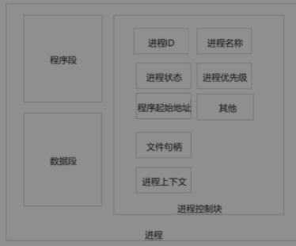
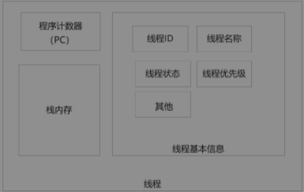

java高并发的核心知识点：
- 多线程
- 线程池
- 锁(java内置锁\juc显式锁)
- JMM(内存模型)
- CAS
- JUC(并发组件)
- AQS(抽象同步器，模板方法设计模式，并发组件实现的基础)
- 高并发设计模式


# 1 多线程、线程池核心原理及实战；线程安全问题；java内置锁的核心原理

进程
```text
进程是操作系统资源分配的最小单位。

进程是程序的一次启动执行，程序可以启动多次，可以对应多个进程，比如chrome浏览器，多个网页对应多个chrome进程。

应用程序以进程的形式运行在OS上。
一般来说，进程包含程序段，数据段和进程控制块3部分。

程序段：代码指令集合在内存中的位置
数据段：操作数集合在内存中的位置
控制块：进程的描述信息和调度信息等

Java进程：
每次启动一个java进程，都会启动一个jvm进程，进程内都是以多个线程来执行，程序入口进去是主线程。还要一个必须的GC线程(守护线程)。

```


线程
```text
线程是CPU调度的最小单位。

CPU时间片调度算法（抢占式获得cpu时间片）

一个线程主要是3部分：线程描述信息，程序计数器（program counter PC）和栈内存

线程ID，一个进程内的thread id不会重复，JVM管理

thread name，可以指定，不指定系统自动分配

线程优先级，只是一种标识，不一定有效，不同系统优先级别不一样，默认1-10，5


线程状态，新建，就绪，运行，阻塞，结束

其他属性，是否是守护线程等

程序计数器，记录的是线程下一条指令的内存地址

栈内存里包含了栈需要的局部变量和方法的栈帧，栈私有，jdk8中，每个线程创建时默认分配1M大小的内存（golang的协程更加轻量级）。

栈内存和堆内存不同，不受GC管理。
```


```java
System.out.println("current thread name: " + 
Thread.currentThread().getName());

System.out.println("current thread id: " + 
Thread.currentThread().getId());

System.out.println("current thread status: " + 
Thread.currentThread().getState());

System.out.println("current thread priority: " + 
Thread.currentThread().getPriority());
```

进程和线程的区别：
```text
1. 一个进程里有多个线程，至少有一个线程
2. 线程是CPU调度的最小单位，进程是OS分配资源的最小单位
3. 进程间互相独立，进程内部的线程可以共享资源
4. 线程上下文切换代价小于进程上下文切换
```

创建线程的4种方式：
```java
// java.lang.Thread
/**
Thread(String name)
Thread(Runnable target)
Thread(Runnable target, String name)

int getId()
String getName()
void setName(String name)
int getPriotity()
void setPriority(int)

static Thread currentThread()
static void sleep(long millis)

void setDaemon(boolean on)
boolean isDaemon()

void start()
void run()

void join()
void join(long millis)
void join(long millis, int nanos)
boolean isAlive()

static void yield()
static void sleep()
*/

public static final int MIN_PRIORITY = 1;
public static final int NORM_PRIORITY = 5;
public static final int MAX_PRIORITY = 10;

public static enum State {
    NEW,            // 新建
    RUNNABLE,       // 就绪，运行
    BLOCKED,        // 阻塞
    WAITING,        // 等待
    TIMED_WAITING,  // 超时等待
    TERMINATED;     // 结束
}

private Runnable target;
public void run() {
    if (this.target != null) {
        this.target.run();
    }
}

// start()启动一个线程
// run()线程逻辑的执行入口函数
```

1. 继承Thread
```java
Thread t = new Thread();
System.out.println(t.getName()); // Thread-0
t.start();

class T extends Thread {
    T(String name) {
        super(name);    
    }
    @Override
    public void run() {
        System.out.println(super.getName()+" running...");
    }
}
T t1 = new T("t1");
t1.start();
```

2. 实现Runnable
```java
// java.lang.Runnable
package java.lang;
@FunctionalInterface
public interface Runnable {
    void run();
}

class Run1 implements Runnable {
    public void run() {
        System.out.println(Thread.currentThread().getName()+" running...");
    }
}
Thread t2 = new Thread(new Run1, "t2");
t2.start();

// 匿名内部类的方式
Thread t3 = new Thread(new Runnable() {
    public void run() {
        System.out.println(Thread.currentThread().getName()+" running...");
    }
});
t3.start();
// lambda方式
new Thread(() -> {
    public void run() {
        System.out.println(Thread.currentThread().getName()+" running...");
    }
}).start();
```


# 2 CAS原理，弊端和规避措施；JUC原子类；JMM核心原理；内存可见性和volatile内存语义

# 3 JUC显式锁原理和使用

# 4 JUC容器类；JUC组件实现的核心组件AQS抽象同步器的原理


# 5 高并发设计模式的原理，使用


